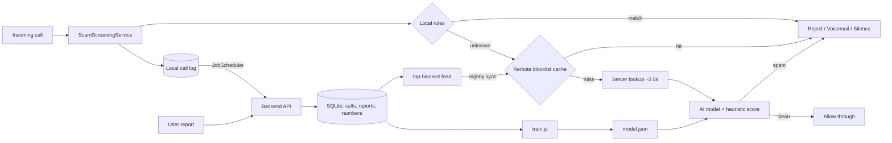

# RobocallGuard — Independent Spam & Robocall Protection Platform

An Android app + self-hosted backend that screens calls and SMS, blocks
robocalls/spam, and builds **its own reputation database** — no reliance on
paid datasets. Includes an AI scoring model trained exclusively on data you
collect.

## Features

**Android app** (`app/`)
- Screens every call routed through the phone system (native dialer + any
  app dialing through telecom) via `CallScreeningService` — runs in the
  background with no UI open
- Rule engine with per-list responses: **reject / voicemail / silence**
  (allowlist, blocklist, prefixes, regex)
- Auto-allow contacts · allowlist-only mode
- **Neighbor-spoofing detection** (callers sharing your NPA-NXX)
- **Server-synced remote blocklist** — blocks known spam instantly, offline
- **Server lookup** for unknown numbers: carrier, line type (VoIP), spam
  score, business name — cached locally within the ~5s screening window
- **VoIP auto-block** — reject numbers on VoIP trunks (toggleable)
- **Every-call log** (SQLite) with lookup results; SMS observation with
  spam flags and alerts
- **Community reporting** — one tap on any call/SMS feeds the reputation DB
- Blocked-call notifications; background uploads via JobScheduler
  (survive reboots)
- In-app settings for everything; server URL + token set at runtime and
  never stored in the repo

**Backend** (`server/`) — Node.js + SQLite
- Ingestion of call records from all devices (per-device analytics)
- Community spam reports
- **Independent reputation scoring**: reports + call frequency + device
  reach + line type + aggressive patterns
- **AI scoring model** (logistic regression, pure JS, zero dependencies):
  - `train.js --from-db` — trains on your collected data
    (reports = spam, allowlist/contact calls = legitimate)
  - `train.js --synthetic` — demo training on generated data
  - served via `/api/v1/lookup` (`aiScore`, `aiSpam`) and `/api/v1/model`
  - heuristic scorer always provides a safety floor under the AI
- `GET /api/v1/top-blocked` — feed the app syncs for instant local blocking
- Optional cached external carrier lookups (e.g. numverify) — the server
  works fully without them
- Deploy files: systemd unit, nginx config, `.env.example`

## Architecture



## Repository layout

```
app/                  Android app (Kotlin, minSdk 29)
  src/main/java/com/example/robocallguard/
server/               Node.js backend
  index.js            API + integration
  train.js            model training CLI
  features.js         AI feature extraction
  labeling.js         ground-truth dataset builder
  model.js            inference
  scoring.js          heuristic scorer
  db.js providers.js  storage + optional lookups
  test/               node --test suite
  deploy/             systemd + nginx
.github/workflows/    CI: APK build + server tests
```

## API contract

| Method | Path | Purpose |
|---|---|---|
| POST | `/api/v1/lookup` | `{number, token}` → `{spamScore, aiScore, aiSpam, carrier, lineType, business, ...}` |
| POST | `/api/v1/calls` | `{device, token, calls: [...]}` — ingest call records |
| POST | `/api/v1/report` | `{number, category, token}` — community spam report |
| GET | `/api/v1/top-blocked?token=` | `{numbers: [{number, score}]}` for the app's local blocklist |
| GET | `/api/v1/model?token=` | trained model metadata + metrics |
| GET | `/health` | liveness |

## Permissions (app)

- `INTERNET` — server lookups/upload
- `READ_CONTACTS` — auto-allow contacts (toggleable)
- `POST_NOTIFICATIONS` (Android 13+) — blocked-call/SMS alerts
- `RECEIVE_SMS` — observe + flag spam SMS
- `RECEIVE_BOOT_COMPLETED` — reschedule background sync

Plus the **"Caller ID & spam" role** (required for screening).

## Build

See `server/README.md` for backend deployment.

1. Create `local.properties` with `sdk.dir=/path/to/Android/Sdk`
2. `gradle wrapper --gradle-version 8.7` (once)
3. `./gradlew assembleDebug` → `app/build/outputs/apk/debug/app-debug.apk`
4. `adb install app/build/outputs/apk/debug/app-debug.apk`
5. Open the app: grant the screening role, permissions, set the server
   URL + token

CI (GitHub Actions) builds the APK on every push and runs the server test
suite.

## Training the AI model

```bash
cd server
node train.js --synthetic              # demo on generated data
node train.js --from-db                # train on your collected data
node --test                            # run the test suite
```

The model is retrained whenever enough labeled data accumulates (labels:
community reports vs. allowlist/contact calls). No third-party data is
needed at any point.

## Security & privacy

- Private repo; server IP, keys, and tokens are **never** committed
  (gitignored `.env`, runtime app settings)
- All API traffic should run over HTTPS (nginx + certbot config provided)
- Shared-token auth on every endpoint
- Call data stays in your SQLite DB on your server

## Honest limitations

- Screens only calls routed through the telecom stack; in-app VoIP calls
  (WhatsApp, Google Voice, …) are invisible to every screening app
- No audio access via `CallScreeningService` — script detection requires
  call takeover (RoboKiller-style), a later, opt-in, legally-sensitive
  feature
- STIR/SHAKEN attestation is carrier-only by regulation
- Non-default SMS apps can flag but not silently drop SMS
- Only one call-screening app can hold the role at a time

## Roadmap

- [x] Screening engine, rules UI, call log, notifications
- [x] Independent reputation backend + community reports
- [x] AI scoring model + training pipeline (tested in CI)
- [ ] Honeypot collector (bait robocallers) + admin dashboard
- [ ] Caller-ID overlay (dialer app) and branded business data
- [ ] Opt-in audio screening (with legal review)
- [ ] Release signing + distribution
